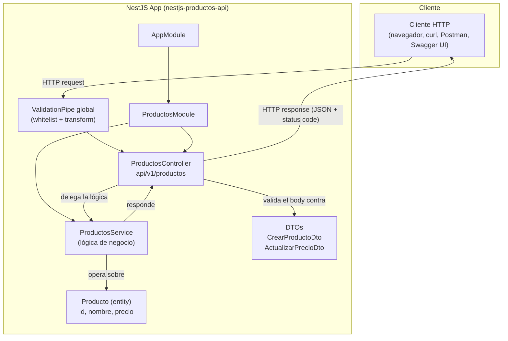
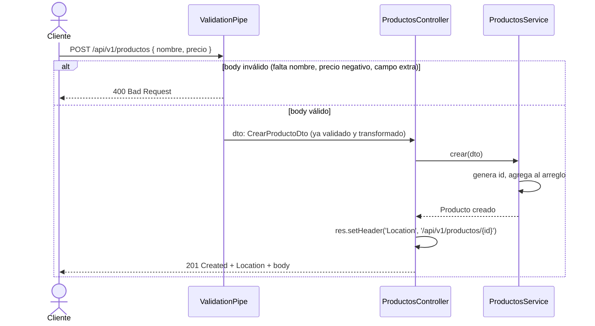
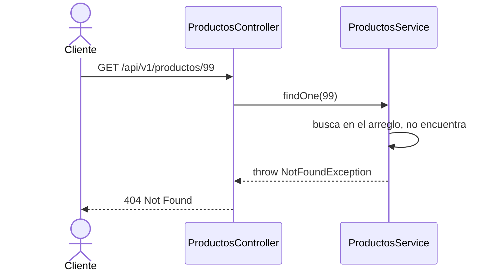
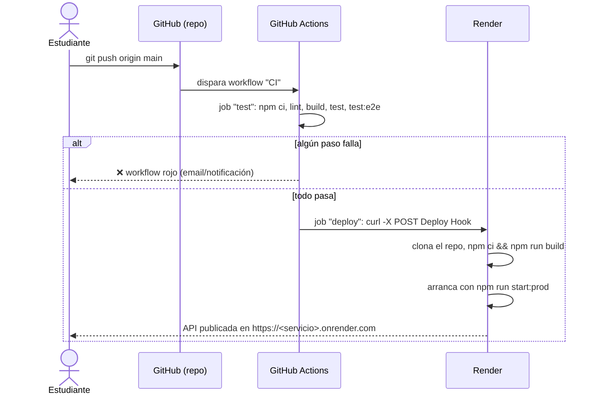
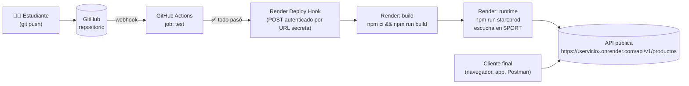

# API de Productos con NestJS — Semana 2, Integración de Sistemas

Práctica guiada: construcción de una **API REST CRUD** con [NestJS](https://nestjs.com/), validación de entrada con DTOs, pruebas automatizadas, integración continua con **GitHub Actions** y despliegue continuo en **Render**.

Este documento está pensado para que un estudiante pueda **replicar la práctica desde cero**, entendiendo el *por qué* de cada paso, no solo el *cómo*.

---

## Tabla de contenidos

1. [Objetivos de aprendizaje](#1-objetivos-de-aprendizaje)
2. [Arquitectura de la aplicación](#2-arquitectura-de-la-aplicación)
3. [Contrato de la API](#3-contrato-de-la-api)
4. [Estructura del proyecto](#4-estructura-del-proyecto)
5. [Réplica paso a paso](#5-réplica-paso-a-paso)
6. [Diagramas de secuencia](#6-diagramas-de-secuencia)
7. [Pruebas automatizadas](#7-pruebas-automatizadas)
8. [Control de versiones con Git y GitHub](#8-control-de-versiones-con-git-y-github)
9. [Integración continua (CI) con GitHub Actions](#9-integración-continua-ci-con-github-actions)
10. [Despliegue continuo (CD) en Render](#10-despliegue-continuo-cd-en-render)
11. [Diagrama de arquitectura de despliegue](#11-diagrama-de-arquitectura-de-despliegue)
12. [Errores comunes y cómo se resolvieron](#12-errores-comunes-y-cómo-se-resolvieron)
13. [Comandos de referencia rápida](#13-comandos-de-referencia-rápida)

---

## 1. Objetivos de aprendizaje

Al terminar esta práctica, el estudiante debe ser capaz de:

- Explicar la arquitectura en capas de NestJS (**Controller → Service → Entity**) y el rol de cada una.
- Implementar un CRUD completo respetando un **contrato REST** (verbos HTTP y códigos de estado correctos).
- Validar datos de entrada de forma declarativa con `class-validator` y DTOs.
- Escribir y ejecutar pruebas unitarias y end-to-end (e2e) con Vitest.
- Versionar un proyecto con Git y publicarlo en GitHub.
- Configurar un pipeline de **Integración Continua** que corra lint, build y pruebas en cada push.
- Configurar **Despliegue Continuo** hacia un proveedor cloud (Render), disparado únicamente cuando el pipeline de CI es exitoso.
- Diagnosticar y resolver errores reales de TypeScript, del entorno de CI y de configuración de despliegue.

---

## 2. Arquitectura de la aplicación

NestJS organiza el código en **módulos**, y cada módulo agrupa **controladores** (reciben peticiones HTTP), **servicios** (contienen la lógica de negocio) y, opcionalmente, **entidades/DTOs** (forma de los datos).



**Puntos clave de la arquitectura:**

- El **Controller** (`productos.controller.ts`) **no contiene lógica de negocio**: solo mapea rutas HTTP a métodos del servicio y traduce el resultado a una respuesta HTTP (código de estado, headers, cuerpo).
- El **Service** (`productos.service.ts`) contiene el estado (en este ejercicio, un arreglo en memoria) y las reglas de negocio (buscar, crear, reemplazar, actualizar, eliminar).
- Los **DTOs** (*Data Transfer Objects*) definen y validan la **forma de los datos que entran** por el body de la petición. Nunca se debe confiar en el cliente: el `ValidationPipe` global rechaza cualquier campo no declarado (`forbidNonWhitelisted`) y transforma tipos automáticamente (`transform: true`).
- La **Entity** (`producto.entity.ts`) define la forma de los datos que **salen** (el recurso persistido).

Esta separación (Controller / Service / DTO / Entity) es el mismo patrón que se usará más adelante con una base de datos real: solo cambiaría la implementación interna del `ProductosService` (de un arreglo en memoria a un repositorio de base de datos), sin tocar el Controller.

---

## 3. Contrato de la API

Antes de escribir una sola línea de código, se definió el contrato REST del recurso `productos` (`contrato.md`). Definir el contrato primero es una práctica de diseño **contract-first**: obliga a pensar en los casos de éxito y error antes de implementar.

| Operación           | Verbo    | URI                          | Éxito         |
|----------------------|----------|------------------------------|---------------|
| Listar               | `GET`    | `/api/v1/productos`          | `200`         |
| Obtener uno          | `GET`    | `/api/v1/productos/{id}`     | `200` / `404` |
| Crear                | `POST`   | `/api/v1/productos`          | `201` + `Location` |
| Reemplazar (total)   | `PUT`    | `/api/v1/productos/{id}`     | `204`         |
| Actualizar (parcial) | `PATCH`  | `/api/v1/productos/{id}`     | `200`         |
| Eliminar             | `DELETE` | `/api/v1/productos/{id}`     | `204` / `404` |

Notas de diseño REST relevantes:

- `POST` responde `201 Created` **y** un header `Location` con la URL del recurso creado — así el cliente sabe dónde consultarlo después.
- `PUT` reemplaza el recurso completo (requiere todos los campos del DTO) y responde `204 No Content` (no hay cuerpo que devolver: el cliente ya sabe qué envió).
- `PATCH` modifica un único campo (`precio`) y sí devuelve el recurso actualizado con `200`.
- `GET` y `DELETE` sobre un `id` inexistente devuelven `404 Not Found` (vía `NotFoundException` de Nest).

---

## 4. Estructura del proyecto

```
nestjs-productos-api/
├── src/
│   ├── main.ts                          # Bootstrap: ValidationPipe global + Swagger
│   ├── app.module.ts                    # Módulo raíz, importa ProductosModule
│   ├── app.controller.ts / app.service.ts
│   └── productos/
│       ├── productos.module.ts          # Agrupa Controller + Service del recurso
│       ├── productos.controller.ts      # Rutas HTTP (api/v1/productos)
│       ├── productos.service.ts         # Lógica de negocio (CRUD en memoria)
│       ├── producto.entity.ts           # Forma del recurso persistido
│       └── dto/
│           ├── crear-producto.dto.ts        # Validación de POST y PUT
│           └── actualizar-precio.dto.ts     # Validación de PATCH
├── test/
│   └── app.e2e-spec.ts                  # Prueba end-to-end (arranca la app real)
├── contrato.md                          # Contrato REST (diseño previo al código)
├── .github/workflows/ci.yml             # Pipeline de CI/CD
├── package.json
└── package-lock.json
```

---

## 5. Réplica paso a paso

### 5.1. Generar el proyecto base

```bash
npm i -g @nestjs/cli
nest new nestjs-productos-api
cd nestjs-productos-api
```

### 5.2. Instalar dependencias de validación y documentación

```bash
npm install class-validator class-transformer
npm install @nestjs/swagger
npm install express          # driver HTTP subyacente (ya viene con @nestjs/platform-express)
```

### 5.3. Generar el módulo del recurso

```bash
nest g module productos
nest g controller productos --flat
nest g service productos --flat
```

### 5.4. Definir la entidad

`src/productos/producto.entity.ts` — la forma del recurso que se expone al cliente:

```ts
export class Producto {
  id: number;
  nombre: string;
  precio: number;
}
```

### 5.5. Definir los DTOs con validación declarativa

`src/productos/dto/crear-producto.dto.ts`:

```ts
import { IsNotEmpty, IsNumber, IsPositive, IsString } from 'class-validator';

export class CrearProductoDto {
  @IsString()
  @IsNotEmpty()
  nombre: string;

  @IsNumber()
  @IsPositive()
  precio: number;
}
```

`src/productos/dto/actualizar-precio.dto.ts` (para el `PATCH`, solo valida el campo que se puede cambiar parcialmente):

```ts
import { IsNumber, IsPositive } from 'class-validator';

export class ActualizarPrecioDto {
  @IsNumber()
  @IsPositive()
  precio: number;
}
```

> **¿Por qué DTOs separados y no reutilizar uno solo?** Cada operación HTTP tiene su propio contrato de entrada. `PUT` exige el recurso completo; `PATCH` solo el campo que cambia. Mezclar ambos en un único DTO obligaría a hacer todos los campos opcionales, perdiendo la validación estricta de `POST`/`PUT`.

### 5.6. Implementar el servicio (lógica de negocio)

`src/productos/productos.service.ts` mantiene el estado en un arreglo en memoria y expone un método por operación de negocio: `findAll`, `findOne`, `crear`, `reemplazar`, `actualizarPrecio`, `eliminar`. Cada método que opera sobre un `id` inexistente lanza `NotFoundException`, que Nest traduce automáticamente a una respuesta `404`.

### 5.7. Implementar el controlador (rutas HTTP)

`src/productos/productos.controller.ts` mapea cada verbo HTTP a su método del servicio y fija el código de estado con `@HttpCode(...)` cuando el default de Nest (`200`, o `201` para `POST`) no coincide con el contrato:

```ts
@Controller('api/v1/productos')
export class ProductosController {
  constructor(private readonly productosService: ProductosService) {}

  @Get()
  listar() {
    return this.productosService.findAll();
  }

  @Get(':id')
  obtener(@Param('id', ParseIntPipe) id: number) {
    return this.productosService.findOne(id);
  }

  @Post()
  @HttpCode(HttpStatus.CREATED)
  crear(@Body() dto: CrearProductoDto, @Res({ passthrough: true }) res: Response) {
    const nuevo = this.productosService.crear(dto);
    res.setHeader('Location', `/api/v1/productos/${nuevo.id}`);
    return nuevo;
  }

  @Put(':id')
  @HttpCode(HttpStatus.NO_CONTENT)
  reemplazar(@Param('id', ParseIntPipe) id: number, @Body() dto: CrearProductoDto) {
    this.productosService.reemplazar(id, dto);
  }

  @Patch(':id')
  actualizarPrecio(@Param('id', ParseIntPipe) id: number, @Body() dto: ActualizarPrecioDto) {
    return this.productosService.actualizarPrecio(id, dto);
  }

  @Delete(':id')
  @HttpCode(HttpStatus.NO_CONTENT)
  eliminar(@Param('id', ParseIntPipe) id: number) {
    this.productosService.eliminar(id);
  }
}
```

Puntos a destacar para la clase:

- `ParseIntPipe` convierte y valida el parámetro de ruta `:id` a `number` **antes** de que el método se ejecute; si no es un entero válido, Nest responde `400` automáticamente.
- `@Res({ passthrough: true })` permite tocar la respuesta cruda (para agregar el header `Location`) **sin perder** el manejo automático de Nest (si se usa `@Res()` sin `passthrough`, hay que manejar toda la respuesta manualmente).
- `Response` se importa con `import type` porque solo se usa como **anotación de tipo**, nunca como valor en tiempo de ejecución (ver [sección 12](#12-errores-comunes-y-cómo-se-resolvieron)).

### 5.8. Activar la validación global y Swagger

`src/main.ts`:

```ts
async function bootstrap() {
  const app = await NestFactory.create(AppModule);

  app.useGlobalPipes(
    new ValidationPipe({
      whitelist: true,           // elimina del body cualquier campo no declarado en el DTO
      forbidNonWhitelisted: true, // ...y si sobra un campo, rechaza la petición con 400
      transform: true,            // convierte tipos primitivos automáticamente
    }),
  );

  const config = new DocumentBuilder()
    .setTitle('API de Productos')
    .setDescription('CRUD de productos — Semana 2, Integración de Sistemas')
    .setVersion('1.0')
    .build();
  const document = SwaggerModule.createDocument(app, config);
  SwaggerModule.setup('swagger', app, document);

  await app.listen(process.env.PORT ?? 3000);
}
```

Con `npm run start:dev` la API queda en `http://localhost:3000/api/v1/productos` y la documentación interactiva en `http://localhost:3000/swagger`.

> `process.env.PORT ?? 3000`: en local usa el puerto 3000, pero en Render (o cualquier PaaS) el puerto lo asigna la plataforma en tiempo de ejecución vía esa variable de entorno — si se deja fijo en `3000`, el despliegue no recibirá tráfico.

---

## 6. Diagramas de secuencia

### 6.1. `POST /api/v1/productos` (creación con validación)



### 6.2. `GET /api/v1/productos/{id}` (recurso inexistente)



### 6.3. Pipeline completo de CI/CD (de `git push` a producción)



---

## 7. Pruebas automatizadas

El proyecto usa [Vitest](https://vitest.dev/) (en vez de Jest, el default histórico de Nest) con dos configuraciones separadas:

| Comando            | Configuración              | Qué prueba |
|---------------------|-----------------------------|------------|
| `npm test`          | `vitest.config.ts`          | Pruebas **unitarias** (aisladas, con mocks) |
| `npm run test:e2e`  | `vitest.config.e2e.ts`      | Pruebas **end-to-end**: levanta la aplicación completa (`Test.createTestingModule`) y le pega peticiones HTTP reales con `supertest` |
| `npm run test:cov`  | `vitest.config.ts` + cobertura | Igual que `test`, con reporte de cobertura |

Ejemplo de prueba e2e (`test/app.e2e-spec.ts`): arranca la app de verdad y hace una petición HTTP real contra ella, verificando código de estado y cuerpo de la respuesta — a diferencia de una prueba unitaria, aquí sí se ejercitan `ValidationPipe`, ruteo y serialización tal como ocurrirían en producción.

**Ejercicio propuesto para el estudiante:** agregar pruebas e2e para cada operación del contrato (`POST`, `PUT`, `PATCH`, `DELETE` y sus casos `404`), replicando el patrón de `app.e2e-spec.ts` pero apuntando a `/api/v1/productos`.

---

## 8. Control de versiones con Git y GitHub

```bash
git init
git config user.name  "Tu Nombre"
git config user.email "tu-correo@dominio.com"

git add -A
git commit -m "Initial commit: API de productos con NestJS"

git remote add origin https://github.com/<usuario>/<repositorio>.git
git push -u origin main
```

Buenas prácticas aplicadas:

- `.gitignore` excluye `node_modules/`, `dist/` y artefactos de build — **nunca** se versiona lo que se puede regenerar con `npm install` / `npm run build`.
- Se usó `git status` antes de cada `add` para revisar exactamente qué se iba a subir (evitar subir secretos por accidente).
- El identificador de autor (`user.name` / `user.email`) se configuró **antes** del primer commit, para que el historial quede correctamente atribuido.

---

## 9. Integración continua (CI) con GitHub Actions

Archivo: [`.github/workflows/ci.yml`](.github/workflows/ci.yml)

```yaml
name: CI

on:
  push:
    branches: [main]
  pull_request:
    branches: [main]

jobs:
  test:
    runs-on: ubuntu-latest
    steps:
      - uses: actions/checkout@v4
      - uses: actions/setup-node@v4
        with:
          node-version: 24
          cache: npm
      - run: npm ci
      - run: npm run lint
      - run: npm run build
      - run: npm test
      - run: npm run test:e2e

  deploy:
    needs: test
    if: github.ref == 'refs/heads/main' && github.event_name == 'push'
    runs-on: ubuntu-latest
    steps:
      - name: Trigger Render deploy
        run: curl -fsS -X POST "$RENDER_DEPLOY_HOOK_URL"
        env:
          RENDER_DEPLOY_HOOK_URL: ${{ secrets.RENDER_DEPLOY_HOOK_URL }}
```

**Cómo leerlo:**

- El job `test` corre en **cada** push y en **cada** pull request a `main`: nadie despliega código que no compila o que rompe una prueba.
- `npm ci` (no `npm install`) en CI: instala **exactamente** lo que dice `package-lock.json`, de forma reproducible — es la práctica recomendada para entornos de integración.
- El job `deploy` declara `needs: test`: **no se ejecuta si `test` falla**. Además, la condición `if` restringe el deploy a pushes directos sobre `main` (no a pull requests ni a otras ramas).
- El disparo del deploy no usa el auto-deploy nativo de Render (que redespliega ante *cualquier* push), sino un **Deploy Hook**: una URL secreta que, al recibir un `POST`, le indica a Render "despliega ahora". Esto centraliza el control del despliegue en el pipeline de CI: solo se despliega si el código pasó todas las validaciones.
- `RENDER_DEPLOY_HOOK_URL` se guarda como **secret** del repositorio (Settings → Secrets and variables → Actions) y nunca se escribe en texto plano en el workflow ni en el historial de git.

---

## 10. Despliegue continuo (CD) en Render

### 10.1. Crear el servicio

1. En [render.com](https://render.com) → **New → Web Service** → conectar el repositorio de GitHub.
2. **Root Directory**: vacío (el repositorio ya es la raíz del proyecto Nest).
3. **Build Command**: `npm ci && npm run build`
4. **Start Command**: `npm run start:prod` (ejecuta `node dist/main`)
5. **Auto-Deploy**: **No** — el despliegue lo dispara el workflow de GitHub Actions, no cada push directo.

### 10.2. Obtener el Deploy Hook

En el servicio → **Settings → Deploy Hook** → copiar la URL. Esa URL es un secreto: quien la tenga puede disparar un deploy.

### 10.3. Registrar el secreto en GitHub

Repositorio → **Settings → Secrets and variables → Actions → New repository secret**:

- **Name**: `RENDER_DEPLOY_HOOK_URL`
- **Value**: la URL copiada en el paso anterior.

### 10.4. Variables de entorno relevantes

- `PORT`: la asigna Render automáticamente; por eso `main.ts` escucha en `process.env.PORT ?? 3000` y nunca en un puerto fijo.
- El campo `"engines": { "node": ">=24" }` de `package.json` le indica a Render (y a cualquier plataforma que lo respete) qué versión de Node usar para el build, evitando el desajuste descrito en la [sección 12.4](#124-npm-ci-falla-solo-en-ci-desajuste-de-versión-de-npm).

---

## 11. Diagrama de arquitectura de despliegue



---

## 12. Errores comunes y cómo se resolvieron

Esta sección documenta, a propósito, los errores **reales** encontrados al construir esta práctica. Reproducirlos y entenderlos es tan formativo como escribir el código que funciona a la primera.

### 12.1. `TS1272: A type referenced in a decorated signature must be imported with 'import type'...`

**Causa:** con `isolatedModules` y `emitDecoratorMetadata` activos en `tsconfig.json`, TypeScript necesita saber, para cada import, si se usa como **valor** (una clase que se instancia) o solo como **tipo** (una anotación). `Response` de `express` en `@Res() res: Response` solo se usa como tipo.

```diff
- import { Response } from 'express';
+ import type { Response } from 'express';
```

**Lección:** cuando un import solo aparece en anotaciones de tipo (parámetros, genéricos, retorno), usar `import type`. Ayuda además a que el compilador elimine ese import por completo al transpilar (no genera código JS innecesario).

### 12.2. `TS2304: Cannot find name 'Put' / 'Patch' / 'Delete'`

**Causa:** se usó el decorador (`@Put()`, `@Patch()`, `@Delete()`) sin agregarlo al `import { ... } from '@nestjs/common'`. Cada decorador HTTP de Nest debe importarse explícitamente.

```diff
- import { Body, Controller, Get, HttpCode, HttpStatus, Param, ParseIntPipe, Post, Res } from '@nestjs/common';
+ import { Body, Controller, Delete, Get, HttpCode, HttpStatus, Param, ParseIntPipe, Patch, Post, Put, Res } from '@nestjs/common';
```

**Lección:** este error es puramente mecánico, pero recurrente al ir agregando endpoints uno por uno — conviene importar de una vez todo el set de decoradores HTTP que se planea usar (`Get`, `Post`, `Put`, `Patch`, `Delete`) al diseñar el contrato completo del recurso.

### 12.3. `Cannot find module 'supertest/types'`

**Causa:** la plantilla de pruebas e2e generada por el CLI de Nest asume una versión de `supertest` que exporta sus propios tipos TypeScript en un subpath `supertest/types`. La versión realmente instalada (`supertest@7.2.2`, la más reciente publicada al momento de esta práctica) **no** expone ese subpath ni declara un campo `exports` que lo permita.

```diff
- import { App } from 'supertest/types';
+ import type { Server } from 'node:http';

- let app: INestApplication<App>;
+ let app: INestApplication<Server>;
```

**Lección:** las plantillas generadas automáticamente (CLI, *scaffolding*) pueden asumir versiones de dependencias distintas a las que realmente se instalan. Ante un error de módulo no encontrado, **verificar qué expone de verdad el paquete instalado** (`node_modules/<paquete>/package.json`, campo `exports`) antes de asumir que es un error de configuración propia.

### 12.4. `npm ci` falla solo en CI: desajuste de versión de npm

**Síntoma:** `npm ci` funcionaba perfecto en la máquina local, pero fallaba en GitHub Actions con:

```
npm error `npm ci` can only install packages when your package.json and package-lock.json
npm error or npm-shrinkwrap.json are in sync. Please update your lock file with `npm install`
npm error Missing: typescript@5.9.3 from lock file
```

**Diagnóstico:** se reprodujo el entorno del runner de GitHub Actions localmente con Docker (`docker run --rm node:22 ...`), confirmando que el `node:22` de esa fecha trae **npm 10.9.8**, mientras que el `package-lock.json` había sido generado con **npm 11.19** (la versión instalada en la máquina de desarrollo, que acompaña a Node 24). Esa diferencia de versión de npm interpreta distinto una dependencia opcional/peer del lockfile, y `npm ci` — que es estricto por diseño — lo reporta como "falta".

**Solución:** alinear la versión de Node (y por lo tanto de npm) entre el entorno de desarrollo y el de CI:

```diff
  - uses: actions/setup-node@v4
    with:
-     node-version: 22
+     node-version: 24
```

Y documentar el requisito en `package.json` para que cualquier entorno (incluido Render) use la misma versión:

```json
"engines": { "node": ">=24" }
```

**Lección:** un pipeline de CI no solo valida el *código*, también expone diferencias de *entorno* que en la máquina de un solo desarrollador pasan inadvertidas. Cuando algo "funciona en mi máquina" pero falla en CI, **reproducir el entorno exacto del CI** (aquí, con Docker) es la forma más rápida de encontrar la causa real, en vez de adivinar.

### 12.5. `[ObserveAgentWorker] Error: Telemetry rejected (401)`

**Causa:** el proyecto incluye `@nestjs/observe`, un módulo de observabilidad/telemetría configurado en `app.module.ts` con credenciales de ejemplo (`YOUR_APP_KEY` / `YOUR_APP_SECRET`). Al no ser credenciales reales, el servicio de telemetría rechaza la conexión.

**Impacto:** ninguno sobre la funcionalidad de la API — es un *side-car* de observabilidad, no bloquea peticiones ni pruebas.

**Solución (si no se va a usar):** quitar `@nestjs/observe` de `package.json` y de `app.module.ts`. **Solución (si se quiere usar):** registrarse en el servicio de observabilidad y reemplazar las credenciales de ejemplo por las reales.

---

## 13. Comandos de referencia rápida

```bash
# Desarrollo
npm install              # instalar dependencias
npm run start:dev        # levantar en modo watch (http://localhost:3000)
npm run build             # compilar TypeScript a dist/

# Calidad
npm run lint              # oxlint sobre src/ y test/
npm test                  # pruebas unitarias (vitest)
npm run test:e2e          # pruebas end-to-end (vitest + supertest)
npm run test:cov          # pruebas unitarias con cobertura

# Producción (lo que ejecuta Render)
npm ci && npm run build
npm run start:prod
```

**Documentación interactiva (Swagger):** `http://localhost:3000/swagger` en local, o `https://<tu-servicio>.onrender.com/swagger` una vez desplegado.
